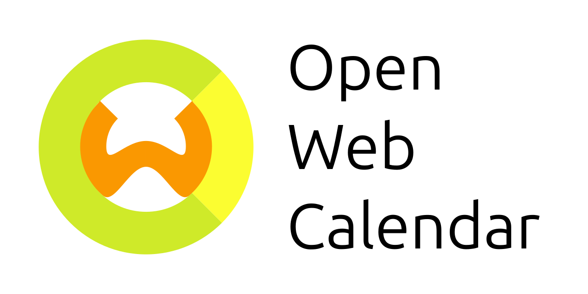

[][web]

[](https://github.com/niccokunzmann/open-web-calendar/actions)
[](https://github.com/niccokunzmann/open-web-calendar/actions/workflows/docker-image.yml)
[][open-collective]
[](https://polar.sh/niccokunzmann/open-web-calendar)


You might want to:
- **[Try&nbsp;it&nbsp;out][web]**
- [Donate using Open Collective][open-collective]
- [Fund specific issues with Polar][polar]
- [Donate using GitHub Sponsors][github-sponsors]
- [See other ways of contributing][donation]

[open-collective]: https://opencollective.com/open-web-calendar/
[github-sponsors]: https://github.com/sponsors/niccokunzmann
[polar]: https://polar.sh/niccokunzmann/open-web-calendar

Python: 3.8, 3.9, 3.10, 3.11, 3.12

There are several commercial solutions which allow embedding of calendars into my website.
I only have a link to an ICS file and want to show a nice-looking calendar on my site.
Browser-only calendars usually have the problem that many ICS files can not be
accessed (such as ownCloud/nextCloud in my case).
I also want to be in control over who knows the people who
visit the site and not pass everything to Google.
This is a solution in my case which I share with the world.
You are free to use it or deploy your own, modify or share it.
It works offline and in company networks, too.

Features
- Embedded calendar
- Choice of time zone
- ICS link, best multiple
- month/week as a view
- name, time of event, link?
- showing the time span
- styling of choice (icon, color, font, ...)

## Contributing
[donation]: #contributing

There are several ways in which you can help this project:

- [Use it][web] and [report errors][issues]
- [Donate using Open Collective][open-collective]
- [Fund specific issues with Polar][polar]
- [Donate using GitHub Sponsors][github-sponsors]
- [Translate this project][translate]
- Have a look at [open issues][issues] e.g. those especially to get started, labelled [good first issue][good-first-issue], leave a note and work on it.

[issues]: https://github.com/niccokunzmann/open-web-calendar/issues
[good-first-issue]: https://github.com/niccokunzmann/open-web-calendar/issues?q=is%3Aissue+is%3Aopen+label%3A%22good+first+issue%22

### Translation
[translate]: #translation

You can help us by [translating the project][weblate] to your language.
If your language is not listed, please request to add it!

- [Translate on Weblate][weblate]

Here, you can see the current translation status:

[][weblate]


[weblate]: https://hosted.weblate.org/engage/open-web-calendar/

## Deployment

There are several ways to deploy the open-web-calendar.

### Environment Variables - Configuration

These environment variables can be used to configure the service:

- `APP_DEBUG` default `true`, values `true` or `false`, always `false` in the Docker container  
  Set the debug flag for the app.
- `PORT` default `5000`, default `80` in the Docker container  
  The port that the service is running on.
- `WORKERS` default `4` only for the Docker container  
  The number of parallel workers to handle requests.
- `CACHE_REQUESTED_URLS_FOR_SECONDS` default `600`  
  Seconds to cache the calendar files that get downloaded to reduce bandwidth and delay.

### SSRF Protection with a Proxy Server

The Open Web Calendar can be used to access the local network behind a firewall,
see [Issue 250](https://github.com/niccokunzmann/open-web-calendar/issues/250).
This free access is intended to show calendars from everywhere.
Since `requests` is used by the Open Web Calender,
it can be used to use a proxy as described in the
[`requests` documentation](https://requests.readthedocs.io/en/latest/user/advanced/#proxies).
The proxy can then handle the filtering.

``` sh
export HTTP_PROXY="http://10.10.1.10:3128"
export HTTPS_PROXY="http://10.10.1.10:1080"
export ALL_PROXY="socks5://10.10.1.10:3434"
```

### Docker

To build the container yourself type the command
```
docker build --tag niccokunzmann/open-web-calendar .
```

You can also use the existing image: [niccokunzmann/open-web-calendar](https://hub.docker.com/r/niccokunzmann/open-web-calendar).

```
docker run -d --rm -p 5000:80 niccokunzmann/open-web-calendar
```

Then, you should see your service running at http://localhost:5000.

#### Container Tags

The container `niccokunzmann/open-web-calendar:latest` contains the latest release.
Containers are also tagged with the version from the [changelog], e.g.
`niccokunzmann/open-web-calendar:v1.10`.

If you wish to run the latest development version, use `niccokunzmann/open-web-calendar:master`.
This includes unchecked translations.

### Docker Compose

Using pre-build Dockerhub image with docker-compose

``` YAML
version: '3'
services:
  open-web-calendar:
    image: niccokunzmann/open-web-calendar
    ports:
      - '80:80'
    environment:
      - WORKERS=4
    restart: unless-stopped
```

To deploy the open-web-calendar with docker-compose, do the following steps:
1. Copy the `docker-compose.yml` file to the directory from where you want to run the container.
2. If needed change port mapping and environment variables.
3. Type `docker-compose up -d` to start the container.
4. The container will be pulled automatically from dockerhub and then starts.

**Important Note:** If you use this service, consider setting up [log rotation](https://ishitashah142.medium.com/why-rotating-docker-logs-is-important-how-to-rotate-docker-logs-840520e4c47) as it is very talkative.

#### Update prebuild image with Docker Compose

If you want to update your image with the latest version from Dockerhub type `docker-compose pull`.

Note: You need to start the container after pulling again in order for the update to apply (`docker-compose up -d`)

#### Preventing SSRF attacks using a Tor proxy

The Open Web Calendar can be configured to use a proxy to request `.ics`
and other files. The following example shows the usage of a Tor proxy.
You can try it out at
[tor.open-web-calendar.hosted.quelltext.eu](https://tor.open-web-calendar.hosted.quelltext.eu/).


``` YAML
version: '3'
services:
  tor-open-web-calendar:
    image: niccokunzmann/open-web-calendar:master
    restart: unless-stopped
    environment:
    # use socks5h for *.onion
    # see https://stackoverflow.com/a/42972942/1320237
      - HTTP_PROXY=socks5h://tor-socks-proxy:9150
      - HTTPS_PROXY=socks5h://tor-socks-proxy:9150
      - ALL_PROXY=socks5h://tor-socks-proxy:9150

  # from https://hub.docker.com/r/peterdavehello/tor-socks-proxy/
  tor-socks-proxy:
    image: peterdavehello/tor-socks-proxy
    restart: unless-stopped
```

The configuration above prevents access to the internal network as the
requests are sent over the Tor network.
A bonus feature is that calendars can be accessed and hosted as a
Tor Hidden Service using an `.onion` address.
E.g. a calendar file can be served from a Raspberry Pi behind a home
network's firewall.
This [example calendar](https://tor.open-web-calendar.hosted.quelltext.eu/calendar.html?url=http%3A%2F%2F3nbwmxezp5hfdylggjjegrkv5ljuhguyuisgotrjksepeyc2hax2lxyd.onion%2Fone-day-event-repeat-every-day.ics) uses [this onion address](http://3nbwmxezp5hfdylggjjegrkv5ljuhguyuisgotrjksepeyc2hax2lxyd.onion/one-day-event-repeat-every-day.ics).

### Vercel

You can create a fork of this repository which automatically deploys to Vercel:

[Deploy](https://vercel.com/new/clone?s=https%3A%2F%2Fgithub.com%2Fniccokunzmann%2Fopen-web-calendar.git)

Alternatively you can create a one off deploy by cloning this repository and running `npx vercel` at the root.

### Heroku

You can deploy the app using Heroku.

[](https://heroku.com/deploy)

Heroku uses [gunicorn](https://gunicorn.org/)
to run the server, see the [Procfile](Procfile).

### Cloudron

The Open Web Calendar has been integrated into [Cloudron](https://www.cloudron.io/).

- [Cloudron Documentation](https://docs.cloudron.io/apps/openwebcalendar/)
- [Cloudron Repository](https://git.cloudron.io/cloudron/openwebcalendar-app)

Research
--------

- https://serverfault.com/questions/142598/open-source-web-application-for-viewing-ics-calendars
- https://stackoverflow.com/questions/300849/html-viewer-for-ics-ical-files
- https://phpicalendar.net
  - https://sourceforge.net/projects/phpicalendar/
- https://icalendar.readthedocs.io/
- https://github.com/rianjs/ical.net
- https://web.archive.org/web/20210201222328/https://stackoverflow.com/questions/4671764/is-there-a-javascript-calendar-that-takes-an-ical-link-as-input-to-display-event
- https://www.webgui.org/content-managers-guide-wiki/calendar
- https://www.quora.com/What-calendars-can-I-embed-in-my-website-that-arent-Google-Calendar

Hosts
- https://www.chronoflocalendar.com/
- with API: http://www.instantcal.com/api.html
- Wordpress: https://de.wordpress.org/plugins/all-in-one-event-calendar/

Sources/Libs
- https://stackoverflow.com/questions/9072802/is-there-an-open-source-javascript-calendar-that-supports-built-in-event-detail#9072985

Search Terms
------------

calendar ics service, ics calendar to html, open source calendar view ical,
python Ical, calendar viewer website for ics, open source calendar website,
embed calendar into website

Software Components
-------------------

- Python3 and the packages in requirements.txt
  - [Flask](http://flask.pocoo.org/)
- [DHTMLX scheduler](https://docs.dhtmlx.com/scheduler/)
- [python-recurring-ical-events](https://github.com/niccokunzmann/python-recurring-ical-events)


Development
-----------

1. Optional: Install virtualenv and Python3 and create a virtual environment.
    ```
    virtualenv -p python3 ENV
    source ENV/bin/activate
    ```
2. Install the packages.
    ```
    pip install -r requirements.txt
    ```
3. Start the app.
    ```
    python3 app.py
    ```

For the configuration of the app through environment variables,
see the [app.json] file.

## Running Tests

To run the tests, we use `tox`.
`tox` tests all different Python versions which we want to
be compatible to.

```
pip install tox
```

Run all tests:

```
tox
```

Run a specific Python version:

```
tox -e py39
```

### Browser Testing

We use selenium to test the app in different browsers.
By default, Firefox is used.
You can test the features like this:

```
tox -e web
```

If you like to change the browser, use
```
tox -e web -- -D browser=firefox
tox -e web -- -D browser=chrome
```

[web]: https://open-web-calendar.hosted.quelltext.eu/

Changelog
---------
[changelog]: #changelog

- v1.26
  - Use HTML color chooser for custom CSS
  - Add a red bar at the current time in the week view and the day view, see [PR 265](https://github.com/niccokunzmann/open-web-calendar/pull/265).
  - Expose the `hour_format` parameter and add choices for the 12h format, see [PR 266](https://github.com/niccokunzmann/open-web-calendar/pull/266).
  - Update Turkish by oersen, Spanish by gallegonovato and German
  - Update dependencies
  - Update GitHub Actions with Dependabot
- v1.25
  - Update dependencies
  - Implement work week view, see [Issue 258](https://github.com/niccokunzmann/open-web-calendar/issues/258)
  - Update translations
- v1.24
  - Test and support Python 3.12
  - Fix rendering error for unknown/malformed time zones (use DHTMLX's timeshift)
  - Improve Indonesian translation by Reza Almanda
- v1.23
  - Add documentation and dependencies to use a Tor proxy to prevent SSRF attacks.
  - Remove temporary cache directory vulnerability [GitHub](https://github.com/niccokunzmann/open-web-calendar/security/code-scanning/2) [CWE-377](https://cwe.mitre.org/data/definitions/377.html)
- v1.22
  - Update dependencies
- v1.21
  - Update Chinese translation by dingc
  - Update French translation by Thomas Moerschell
  - Fix Content-Type header for .js files, see [Issue 241](https://github.com/niccokunzmann/open-web-calendar/issues/241)
  - Add logo [Issue 205](https://github.com/niccokunzmann/open-web-calendar/issues/205)
- v1.20
  - Turkish translation by Oğuz Ersen
  - Spanish translation by gallegonovato
  - Indonesian translation by Reza Almanda
  - Update dependencies
  - Correct links
- v1.19
  - Update dependencies
- v1.18
  - Update dependencies
  - Update Finnish by Teemu
  - Update Slovak by Milan Šalka
  - Update Polish by Piotr Strebski
  - Update Japanese by onokatio
- v1.17
  - Add User-Agent header, see [Issue #225](https://github.com/niccokunzmann/open-web-calendar/issues/225).
  - Close security vulnerability, [Pull Request #223](https://github.com/niccokunzmann/open-web-calendar/pull/223)
  - Update German, Welsh, Croatian
- v1.16
  - Add a dropdown to choose another time zone to view the calendar in the about screen, see [Issue #213](https://github.com/niccokunzmann/open-web-calendar/issues/213).
- v1.15
  - Update dependencies
- v1.14
  - Improve Indonesian translation by Reza Almanda
  - Improve Spanish translation by zyloj
  - Improve Polish translation by Eryk Michalak
  - Update dependencies
  - Do not test Python 3.7 any more
  - Test Python 3.11
- v1.13
  - Improve French translation
  - Update dependencies
- v1.12
  - Add Croatian UI by Milo Ivir
- v1.11
  - Add German UI
  - Improve calendar in Polish
  - Add Welsh calendar
- v1.10
  - Add translations for nb_NO.
  - Translate the user interface.
  - Use weblate to translate files.
- v1.9
  - Speed up loading with start and stop date range. [Pull Request #177](https://github.com/niccokunzmann/open-web-calendar/pull/177).
- v1.8
  - Add start of day, end of day and time step (hour be default) in [Pull Request #158](https://github.com/niccokunzmann/open-web-calendar/pull/158) thanks to [@TheoLeCalvar](https://github.com/TheoLeCalvar).
- v1.7
  - Add timezone functionality. See [Issue #171](https://github.com/niccokunzmann/open-web-calendar/issues/171).
- v1.6
  - Add choice of Sunday or Monday for the start of the week [Issue 39](https://github.com/niccokunzmann/open-web-calendar/issues/39) - backed by [donation]!
- v1.5
  - add link to [Contributing Section](#contributing) in about page
  - make event clickable even if there is a tool tip window
  - [@MrKoga](https://github.com/MrKoga) [donated][github-sponsors] to the project! Thanks!
- v1.4
  - add event categories when you click an event, see [PR 159](https://github.com/niccokunzmann/open-web-calendar/pull/159).
- v1.3
  - update translation mistake
  - fix encoding problem for languages other than en/de
  - add ability to remove all controls
  - test with GitHub actions
  - test user interface
- v1.2
  - Use Gunicorn in Docker image
  - change deployment to https://open-web-calendar.hosted.quelltext.eu/
- v1.1
  - Add Coatian Language by Tomislav Gomerčić
- v1.0
  - Create the changelog.
  - Add support for colors from ICS calendars, see [Issue #52](https://github.com/niccokunzmann/open-web-calendar/issues/52) and [Pull Request 88](https://github.com/niccokunzmann/open-web-calendar/pull/88).

Update Dependencies
-------------------

1. Enter your virtual environment. E.g.
   ```
   source .tox/py39/bin/activate
   ```
2. Install all dependencies:
   ```
   pip install --upgrade -r requirements.in -r test-requirements.in pip-tools
   ```
3. Fix the dependencies:
   ```
   rm *requirements.txt
   pip-compile --output-file=requirements.txt requirements.in
   pip-compile --output-file=test-requirements.txt test-requirements.in
   ```
4. Create a branch, commit:
   ```
   git branch -d update
   git checkout -b update
   git add *requirements.txt
   git commit -m"Update dependencies"
   git push -u origin update
   ```
5. Create a Pull Request and see if the tests run.

Release a new Version
---------------------

To release a new version:
1. Edit the `README.md` file in the Changelog Section and add the changes.
   ```
   git add README.md
   git commit -m"Modify changelog for release"
   git push
   ```
2. Create a tag for the version.
   ```
   git tag v1.6
   git push origin v1.6
   ```
3. Notify solved issues about the release.

Related Work
------------

- [docker-ics-view](https://github.com/11notes/docker-ics-view) and [its Docker image](https://hub.docker.com/r/11notes/ics-view) - a fork of this project with further improvements
- [calender_merger](https://github.com/niccokunzmann/calender_merger) for merging several ICAL files into one
- [ical-filter](https://github.com/thoka/ical-filter) for filtering events in an ICAL file and providing the selection as file
- [Wordpress all in one event calendar](https://wordpress.org/plugins/all-in-one-event-calendar/)
- [My Mailbox Calendar](https://github.com/niccokunzmann/my-mailbox-calendar#readme)

[app.json]: app.json
