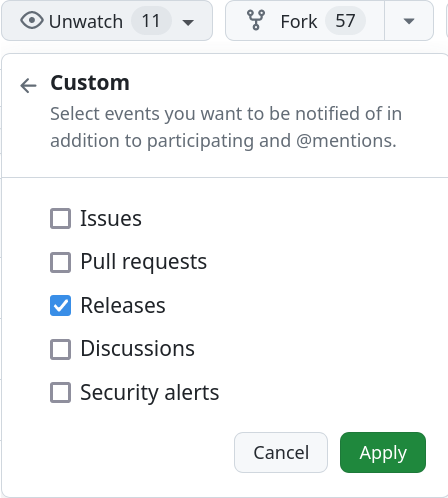

# Self-Hosting & Deployment

You do not have to host the Open Web Calendar yourself but you are encouraged to.
It is intended to work behind a company firewall, through a proxy and also without access to the Internet.

Several hosting options are already documented.
We are grateful if you can add your favorite one, too.

## Default Parameters

The configuration of all calendars is rooted in the [default_specification.yml].
All those values can be changed through a copy of this file hosted on the web
through the calendar parameter `specification_url`.
Each parameter should be documented in [default_specification.yml].

If you modify the default specification, you modify **all calendars** that are hosted at your instance.
You might want to change these values:

- `title`
- `language`
- `favicon`
- `source_code` - if you made changes
- `contributing` - if you want to redirect to contribute to your project

[default_specification.yml]: https://github.com/niccokunzmann/open-web-calendar/blob/master/default_specification.yml

Related:

- [API](../dev/api.md)

## Environment Variables

Environment variables only influence the running of the server.
If you want to change the default design, read the next section.
These environment variables can be used to configure the service:

- `ALLOWED_HOSTS` default empty  
    The hosts divided by comma that the Open Web Calendar permits.
    This is required to mitigate the Host Header Injection vulnerability.  
    You will see this text if the host is not allowed:

    > **Forbidden**
    >
    > You don't have the permission to access the requested resource. It is either read-protected or not readable by the server.

    Examples:

    - permit one host: `localhost`
    - permit several hosts: `open-web-calendar.hosted.quelltext.eu,192.168.0.42`
    - permit all hosts (vulnerable): empty

- `PORT` default `5000`, default `80` in the Docker container  
    The port that the service is running on.
- `WORKERS` default `4` only for the Docker container  
    The number of parallel workers to handle requests.
- `CACHE_REQUESTED_URLS_FOR_SECONDS` default `600`  
    Seconds to cache the calendar files that get downloaded to reduce bandwidth and delay.
- `APP_DEBUG` default `true`, values `true` or `false`, always `false` in the Docker container  
    Set the debug flag for the app.

There are **[more environment variables](https://flask.palletsprojects.com/en/3.0.x/config/)** available to configure the application.

## SSRF Protection with a Proxy Server

The Open Web Calendar can be used to access the local network behind a firewall,
see [Issue 250](https://github.com/niccokunzmann/open-web-calendar/issues/250).
This free access is intended to show calendars from everywhere.
Since `requests` is used by the Open Web Calender,
it can use a proxy as described in the
[`requests` documentation](https://requests.readthedocs.io/en/latest/user/advanced/#proxies).
The proxy can then handle the filtering.

```sh
export HTTP_PROXY="http://10.10.1.10:3128"
export HTTPS_PROXY="http://10.10.1.10:1080"
export ALL_PROXY="socks5://10.10.1.10:3434"
```

See also:

- [Prevent SSRF using a Tor proxy](docker.md#preventing-ssrf-attacks-using-a-tor-proxy)

## Vercel

You can create a fork of this repository which automatically deploys to [Vercel](https://vercel.com/):

[](https://vercel.com/new/clone?repository-url=https%3A%2F%2Fgithub.com%2Fniccokunzmann%2Fopen-web-calendar.git)

Alternatively you can create a one off deploy by cloning this repository and running `npx vercel` at the root.

## Heroku

You can deploy the app using [Heroku](https://heroku.com).

[](https://heroku.com/deploy?template=https://github.com/niccokunzmann/open-web-calendar)

Heroku uses [gunicorn](https://gunicorn.org/)
to run the server, see the [Procfile](https://github.com/niccokunzmann/open-web-calendar/blob/master/Procfile).

## Cloudron

The Open Web Calendar has been integrated into [Cloudron](https://www.cloudron.io/).

- [Cloudron Documentation](https://docs.cloudron.io/apps/openwebcalendar/)
- [Cloudron Repository](https://git.cloudron.io/cloudron/openwebcalendar-app)

## YunoHost

The Open Web Calendar is available as an app for [YunoHost](https://yunohost.org/).

[](https://install-app.yunohost.org/?app=open-web-calendar)

- [App Description](https://apps.yunohost.org/app/open-web-calendar)
- [Repository](https://github.com/YunoHost-Apps/open-web-calendar_ynh/blob/master/ALL_README.md)

## Docker

If you run your own server, you can choose to run the Open Web Calender with Docker.
Building, running and updating are [documented here](docker.md).

## Update Notifications

If you wish to receive notifications about new updates of the software,
watch the [GitHub repository]({{link.repo}}).



[open-web-calendar.hosted.quelltext.eu]: {{link.web}}
[tor.open-web-calendar.hosted.quelltext.eu]: {{link.tor}}
